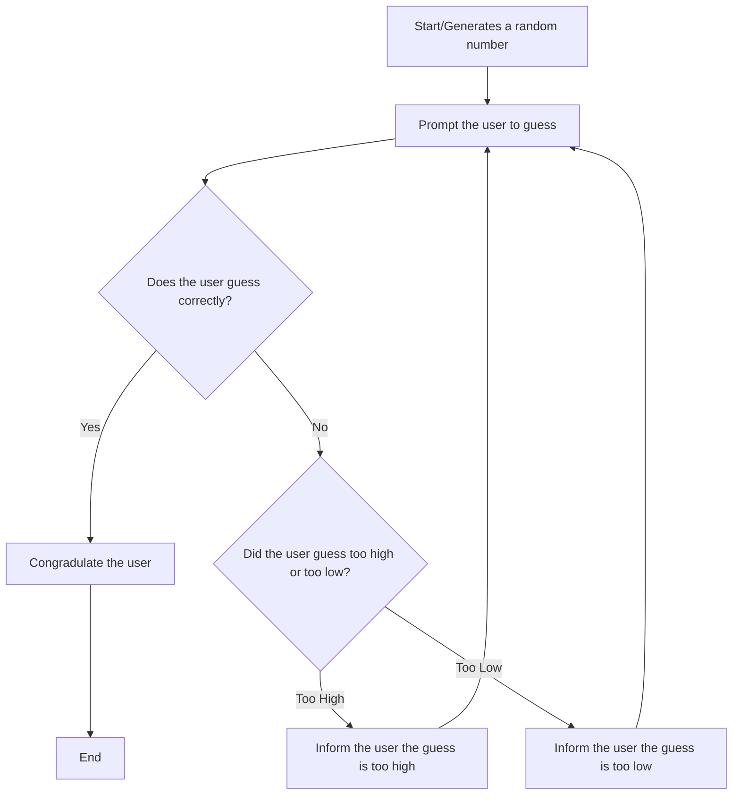

##Guessing Game Flowchart

The guessing game first generates a random number, then prompts the user to guess the number. If the user guessed correctly, it will congratulate the user and exit.
If the user guessed incorrectly, it evaluates if the guess was too high or too low. If the guess was too high, it informs the user that the guess was too high,
and then prompts the user to guess again. If the guess was too low, it informs the user the guess was too low, and then prompts the user to guess again.
The user keeps guessing until they guess correctly or quit.
