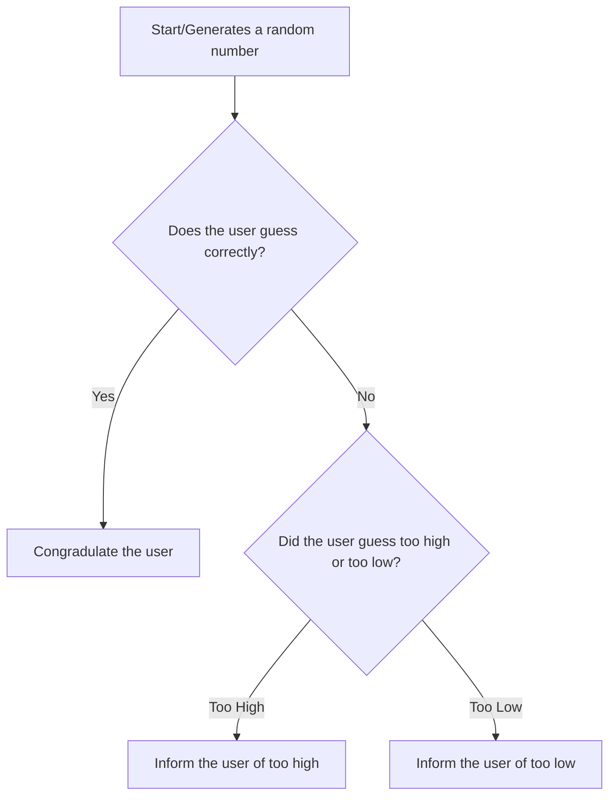

##Guessing Game Flowchart

```mermaid
flowchart TD
A[Start/Generates a random number] --> B{Does the user guess correctly?};
B -- Yes --> C[Congradulate the user];
B -- No --> D{Did the user guess too high or too low?};
D -- Too High --> E[Inform the user of too high];
D -- Too Low --> F[Inform the user of too low];
```
